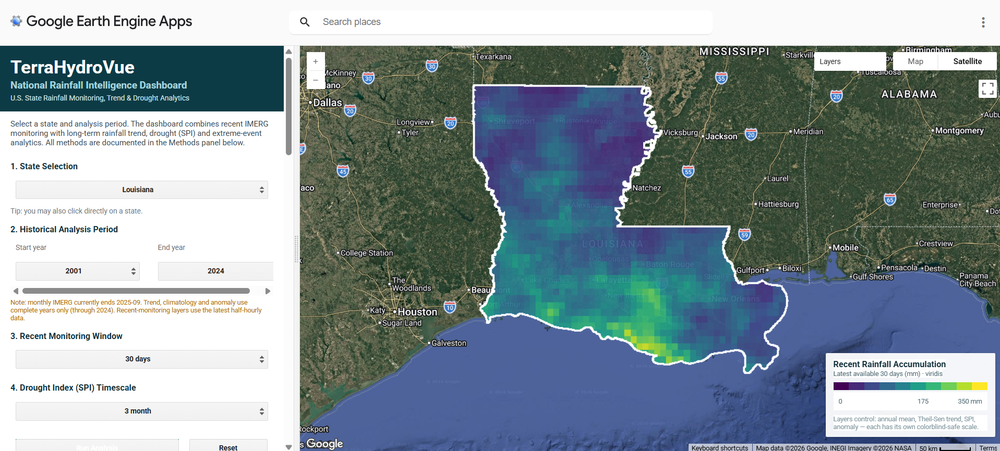
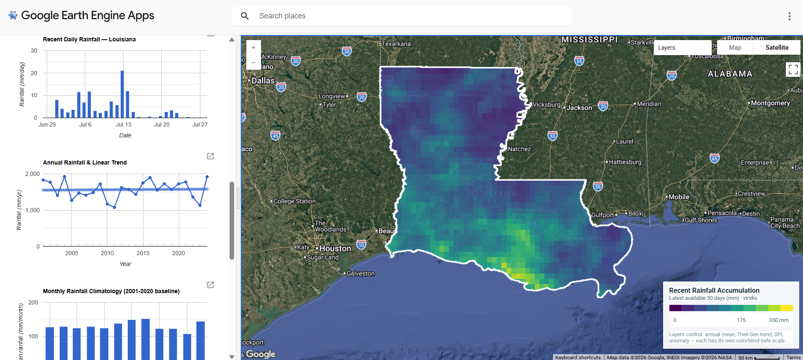
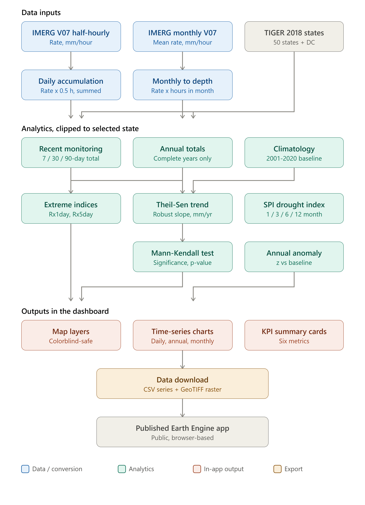
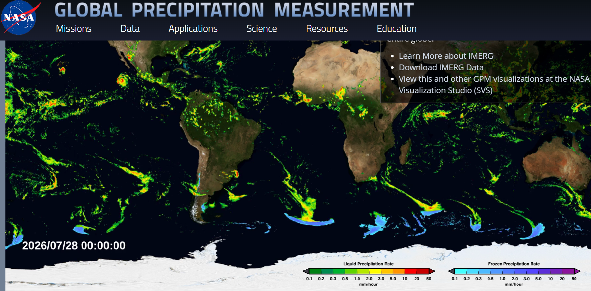

<div align="center">

# TerraHydroVue  
## National Rainfall Intelligence Dashboard — USA

### An interactive Google Earth Engine platform powered by NASA GPM IMERG V07

<p>
  <a href="https://ee-phdstudentuiowa.projects.earthengine.app/view/nasagpmrainfallintelligencedashboard">
    
  </a>
  <a href="./LICENSE">
    
  </a>
</p>

<p>
  
  
  
  
</p>

<p>
  
  
  
  
</p>

**Near-real-time rainfall monitoring, long-term precipitation trend analysis,  
drought assessment, climate anomalies, and extreme-rainfall analytics for the United States.**

</div>

---

## Dashboard Preview

### National Rainfall Monitoring and State Selection

<p align="center">
  
</p>

<p align="center">
  <sub>
    Interactive national rainfall monitoring interface with state selection,
    recent rainfall accumulation, spatial visualization, and summary indicators.
  </sub>
</p>

<br>

### Hydroclimatic Analysis and Statistical Indicators

<p align="center">
  
</p>

<p align="center">
  <sub>
    Long-term rainfall trends, drought indicators, anomalies, extreme-rainfall
    metrics, climatology, and state-level analytical outputs.
  </sub>
</p>

---

## Quick Access

| Resource | Link |
|---|---|
| **Live Interactive Application** | [Launch TerraHydroVue](https://ee-phdstudentuiowa.projects.earthengine.app/view/nasagpmrainfallintelligencedashboard) |
| **Google Earth Engine Script** | [`RainfallDashboard/TerraHydroVue_National_Rainfall_Dashboard.js`](./RainfallDashboard/TerraHydroVue_National_Rainfall_Dashboard.js) |
| **Dashboard Preview 1** | [`RainfallDashboard/Dashboard1.png`](./RainfallDashboard/Dashboard1.png) |
| **Dashboard Preview 2** | [`RainfallDashboard/Dashboard2.png`](./RainfallDashboard/Dashboard2.png) |
| **Analytical Workflow** | [`RainfallDashboard/Flowchart.png`](./RainfallDashboard/Flowchart.png) |
| **NASA GPM Illustration** | [`RainfallDashboard/NASAGPM.png`](./RainfallDashboard/NASAGPM.png) |
| **License** | [MIT License](./LICENSE) |

---

## Project Overview

**TerraHydroVue** is an interactive national rainfall intelligence platform developed in **Google Earth Engine** using **NASA Global Precipitation Measurement Integrated Multi-satellitE Retrievals for GPM Version 07 — GPM IMERG V07**.

The application integrates recent satellite precipitation monitoring with long-term hydroclimatic analysis across all **50 U.S. states and the District of Columbia**.

The dashboard supports:

- recent rainfall monitoring;
- historical rainfall assessment;
- robust precipitation trend estimation;
- drought-condition screening;
- extreme-rainfall analysis;
- standardized anomaly assessment;
- monthly rainfall climatology; and
- state-level raster and tabular data exploration.

The platform is intended for environmental research, hydrology, drought monitoring, rainfall-risk assessment, education, and geospatial decision support.

---

## Core Capabilities

### Recent Rainfall Monitoring

- Rolling **7-day**, **30-day**, and **90-day** rainfall accumulation
- Automatic detection of the latest available IMERG observation
- State-level interactive visualization
- Spatial rainfall classification
- County- and state-scale exploratory interpretation

### Long-Term Rainfall Analysis

- Historical annual rainfall totals
- Monthly rainfall climatology
- Long-term rainfall variability
- Standardized annual rainfall anomalies
- Fixed climate-baseline comparison

### Statistical Trend Assessment

- **Theil–Sen slope** for robust trend-magnitude estimation
- **Mann–Kendall test** for monotonic trend significance
- Rainfall trend expressed in **millimeters per year**
- Separation of increasing, decreasing, and statistically insignificant trends

### Drought Diagnostics

The dashboard includes the **Standardized Precipitation Index** at multiple accumulation periods:

- SPI-1
- SPI-3
- SPI-6
- SPI-12

These timescales support interpretation of short-term meteorological dryness and longer-duration precipitation deficits.

### Extreme-Rainfall Indicators

The dashboard derives satellite-based ETCCDI-style rainfall indicators, including:

- **Rx1day** — maximum one-day rainfall;
- **Rx5day** — maximum consecutive five-day rainfall; and
- additional rainfall-intensity and event-based summaries where applicable.

### Interactive State Selection

Users can select any of the **50 U.S. states or Washington, DC** through the dashboard interface.

The selected administrative unit is used to:

- update the map;
- calculate rainfall statistics;
- generate time-series charts;
- summarize trends and anomalies; and
- prepare analytical outputs.

---

## Application Workflow

<p align="center">
  
</p>

<p align="center">
  <sub>
    TerraHydroVue data-processing, statistical-analysis, visualization,
    and output-generation workflow.
  </sub>
</p>

The general workflow consists of:

1. acquiring NASA GPM IMERG precipitation data;
2. filtering data by date and geographic extent;
3. converting precipitation rates to accumulated rainfall depths;
4. aggregating half-hourly observations into daily totals;
5. aggregating monthly precipitation into annual totals;
6. calculating climatology, anomalies, trends, drought indices, and extremes;
7. clipping the outputs to the selected state;
8. displaying maps, charts, legends, and summary indicators; and
9. supporting export of analytical results.

---

## Study Area

The application covers the entire United States, including:

- all **50 states**; and
- the **District of Columbia**.

Administrative boundaries are obtained from the U.S. Census Bureau TIGER/Line dataset available through Google Earth Engine.

The state boundary collection used in the application is:

```javascript
TIGER/2018/States
```

---

## Data Sources

| Analytical Purpose | Dataset | Google Earth Engine ID |
|---|---|---|
| Recent rainfall monitoring | NASA GPM IMERG V07, 30-minute | `NASA/GPM_L3/IMERG_V07` |
| Daily rainfall and extreme-event analysis | NASA GPM IMERG V07, 30-minute | `NASA/GPM_L3/IMERG_V07` |
| Monthly climatology and long-term analysis | NASA GPM IMERG Monthly V07 | `NASA/GPM_L3/IMERG_MONTHLY_V07` |
| State boundaries | U.S. Census TIGER/Line 2018 | `TIGER/2018/States` |

---

## NASA GPM IMERG

<p align="center">
  
</p>

NASA GPM IMERG combines information from multiple satellite sensors to provide spatially continuous precipitation estimates.

The dataset is particularly useful for:

- rainfall monitoring over data-sparse regions;
- national and regional precipitation analysis;
- spatial comparison of rainfall patterns;
- hydrologic screening;
- drought assessment; and
- extreme-rainfall characterization.

---

## Rainfall-Depth Conversion

IMERG precipitation values are reported as precipitation **rates in millimeters per hour**, rather than direct accumulated rainfall depths.

The dashboard therefore converts precipitation rates to rainfall depths before temporal aggregation.

### Half-Hourly IMERG

For each 30-minute observation:

\[
P_{30\text{min}} = R \times 0.5
\]

where:

- \(P_{30\text{min}}\) is accumulated rainfall depth in millimeters; and
- \(R\) is the IMERG precipitation rate in millimeters per hour.

Daily rainfall is calculated by summing all valid half-hourly rainfall depths within each day.

### Monthly IMERG

Monthly rainfall depth is calculated as:

\[
P_{\text{month}} = R_{\text{month}} \times H_{\text{month}}
\]

where:

- \(R_{\text{month}}\) is the monthly precipitation rate;
- \(H_{\text{month}}\) is the number of hours in the month; and
- \(P_{\text{month}}\) is total monthly rainfall depth in millimeters.

This conversion is necessary to avoid treating precipitation rates as accumulated rainfall totals.

---

## Scientific Methods

### Theil–Sen Trend Estimator

The Theil–Sen estimator is used to calculate the magnitude of long-term rainfall change.

It is more resistant to outliers than ordinary least-squares regression and is appropriate for hydroclimatic time series that may contain extreme wet or dry years.

Trend magnitude is reported as:

\[
\text{Rainfall trend} = \text{mm year}^{-1}
\]

### Mann–Kendall Trend Test

The Mann–Kendall test is used to assess whether the temporal rainfall trend is statistically significant.

The dashboard distinguishes among:

- statistically significant increasing trends;
- statistically significant decreasing trends; and
- trends that are not statistically significant.

The default significance threshold is:

\[
p < 0.05
\]

### Standardized Precipitation Index

SPI is calculated at several temporal accumulation periods to characterize rainfall deficits and surpluses.

| SPI Value | General Interpretation |
|---:|---|
| ≥ 2.00 | Extremely wet |
| 1.50 to 1.99 | Severely wet |
| 1.00 to 1.49 | Moderately wet |
| −0.99 to 0.99 | Near normal |
| −1.00 to −1.49 | Moderate drought |
| −1.50 to −1.99 | Severe drought |
| ≤ −2.00 | Extreme drought |

### Extreme-Rainfall Indices

| Index | Description |
|---|---|
| **Rx1day** | Maximum one-day rainfall during the analysis period |
| **Rx5day** | Maximum accumulated rainfall over five consecutive days |
| **Rainfall intensity** | Rainfall amount relative to the selected accumulation period |
| **Wet-event summaries** | Characteristics of high-rainfall periods where implemented |

### Standardized Rainfall Anomaly

Annual rainfall anomaly is calculated relative to the selected climate baseline:

\[
Z = \frac{P_y-\mu_b}{\sigma_b}
\]

where:

- \(P_y\) is annual rainfall in year \(y\);
- \(\mu_b\) is mean rainfall during the baseline period; and
- \(\sigma_b\) is the baseline standard deviation.

---

## Climate Baseline

The default climatological baseline is:

```text
2001–2020
```

This period is used for:

- rainfall climatology;
- standardized annual anomalies;
- drought-index standardization; and
- comparison of recent rainfall conditions with historical conditions.

The selected baseline reflects the temporal availability of the IMERG archive and provides a consistent IMERG-native reference period.

---

## Visualization Design

TerraHydroVue uses visually interpretable palettes designed for scientific communication.

The visualization strategy includes:

- sequential palettes for rainfall magnitude;
- diverging palettes for positive and negative anomalies;
- distinct colors for increasing and decreasing trends;
- standardized map legends;
- interactive layer control;
- satellite and map basemaps; and
- colorblind-conscious palette selection where possible.

Typical palettes include:

- **Viridis** for rainfall magnitude;
- **BrBG** for wet–dry anomalies; and
- **RdBu** for negative–positive departures.

---

## Export and Reproducibility

The application is designed to support reproducible analysis and output generation.

Depending on the selected analysis, outputs may include:

- daily rainfall time series;
- annual rainfall totals;
- monthly climatology;
- rainfall-trend summaries;
- SPI time series;
- anomaly statistics;
- extreme-rainfall indicators;
- CSV tables; and
- GeoTIFF raster outputs.

Large-area or multi-decadal exports may require the user to run export tasks through their own Google Earth Engine account.

---

## How to Use the Live Dashboard

1. Open the [TerraHydroVue live application](https://ee-phdstudentuiowa.projects.earthengine.app/view/nasagpmrainfallintelligencedashboard).
2. Select a state from the dropdown menu.
3. Choose the required rainfall-analysis period.
4. Select a monitoring or long-term analytical product.
5. Click **Run Analysis**.
6. Review the map, rainfall statistics, time-series charts, and legends.
7. Activate or deactivate layers using the layer manager.
8. Export available outputs where required.

---

## Run the Code in Google Earth Engine

1. Sign in to the [Google Earth Engine Code Editor](https://code.earthengine.google.com/).
2. Create a new JavaScript script.
3. Open the repository script:

   [`RainfallDashboard/TerraHydroVue_National_Rainfall_Dashboard.js`](./RainfallDashboard/TerraHydroVue_National_Rainfall_Dashboard.js)

4. Copy the complete JavaScript code.
5. Paste it into the Google Earth Engine Code Editor.
6. Click **Run**.
7. Select a state and analysis period.
8. Run the required rainfall analysis.

---

## Repository Structure

```text
National_Rainfall_USA_NASA_GPM/
├── README.md
├── LICENSE
└── RainfallDashboard/
    ├── Dashboard1.png
    ├── Dashboard2.png
    ├── Flowchart.png
    ├── NASAGPM.png
    └── TerraHydroVue_National_Rainfall_Dashboard.js
```

---

## Potential Applications

TerraHydroVue can support:

- national and state-level rainfall monitoring;
- hydrologic assessment;
- drought-condition screening;
- flood-hazard reconnaissance;
- agricultural water-management studies;
- climate-variability analysis;
- environmental decision support;
- geospatial education;
- remote-sensing demonstrations;
- rainfall-risk communication; and
- exploratory hydroclimatic research.

---

## Scientific Limitations

### Satellite-Derived Rainfall

IMERG provides satellite-derived gridded precipitation estimates. These values should not be interpreted as exact rain-gauge observations.

Independent validation with quality-controlled gauge networks is recommended for operational, engineering, or publication-grade applications.

### Spatial Resolution

IMERG represents spatially averaged precipitation over grid cells. Local convective storms and highly localized rainfall maxima may not be fully represented.

### Extreme-Rainfall Uncertainty

Satellite-based Rx1day and Rx5day indices may carry greater uncertainty than corresponding indices calculated from dense gauge networks.

### SPI Approximation

The Earth Engine SPI implementation may differ from conventional station-based gamma-distribution SPI calculations, particularly at shorter accumulation periods.

Results should therefore be interpreted as satellite-based standardized precipitation indicators.

### Computational Demand

Multi-decadal raster calculations across large states can be computationally intensive. Interactive calculations may use a coarser processing scale than final exported products.

### Climate Baseline Length

The 2001–2020 baseline is shorter than a conventional 30-year climate normal. It is used because of the temporal availability of the IMERG record.

---

## Recommended Validation

For research and operational applications, TerraHydroVue outputs should be evaluated against independent precipitation observations such as:

- NOAA Global Historical Climatology Network;
- NOAA Climate Data Online;
- U.S. Climate Reference Network;
- state mesonet observations;
- National Weather Service cooperative stations; and
- other quality-controlled regional rain-gauge networks.

Recommended validation metrics include:

- Pearson or Spearman correlation;
- mean bias;
- mean absolute error;
- root mean square error;
- Kling–Gupta efficiency;
- probability of detection;
- false-alarm ratio; and
- critical success index.

---

## Author

### Mirza Md Tasnim Mukarram

**Informatics, Department of Computer Science**  
**School of Earth, Environment, and Sustainability**  
**The University of Iowa**

FAA Part 107 Certified Remote Pilot  
PGD in Data Science  
M.Econ in Environmental Economics  
B.Sc. in Civil & Environmental Engineering

**Office:**  
216 Jessup Hall  
5 West Jefferson Street  
Iowa City, Iowa 52242  
United States

**Email:** [mtasnimmukarram@uiowa.edu](mailto:mtasnimmukarram@uiowa.edu)  
**Phone:** +1 (319) 800-8098

---

## Suggested Citation

When using the application, repository, code, or derived outputs, please cite this project together with the underlying NASA GPM IMERG dataset.

> Mukarram, M. M. T. (2026). *TerraHydroVue: National Rainfall Intelligence Dashboard for the United States—An interactive Google Earth Engine application using NASA GPM IMERG V07*. GitHub repository.

A formal archival citation and DOI can be added after depositing a repository release in a DOI-assigning service such as Zenodo.

---

## Data Citation

Users should also cite the appropriate NASA GPM IMERG V07 products used in their analyses.

Dataset documentation and citation information are available through the NASA Goddard Earth Sciences Data and Information Services Center.

---

## License

This repository is distributed under the **MIT License**.

See [`LICENSE`](./LICENSE) for the complete license text.

The NASA GPM IMERG and U.S. Census TIGER/Line datasets retain their respective data-use, acknowledgment, and citation requirements.

---

## Acknowledgments

This application uses:

- NASA Global Precipitation Measurement mission data;
- NASA GPM IMERG V07 precipitation products;
- Google Earth Engine cloud-computing infrastructure; and
- U.S. Census Bureau TIGER/Line administrative boundaries.

---

<div align="center">

## Launch TerraHydroVue

### [Open the National Rainfall Intelligence Dashboard](https://ee-phdstudentuiowa.projects.earthengine.app/view/nasagpmrainfallintelligencedashboard)

<br>

**Rainfall monitoring • Trend detection • Drought assessment • Extreme-event analytics**

<br>

If this repository supports your work, consider giving it a ⭐

</div>
